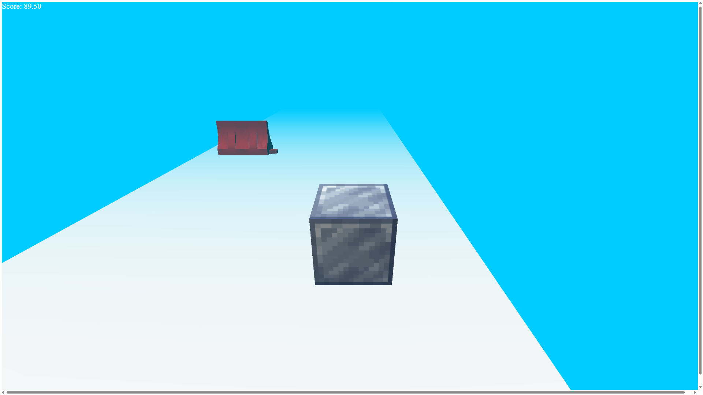
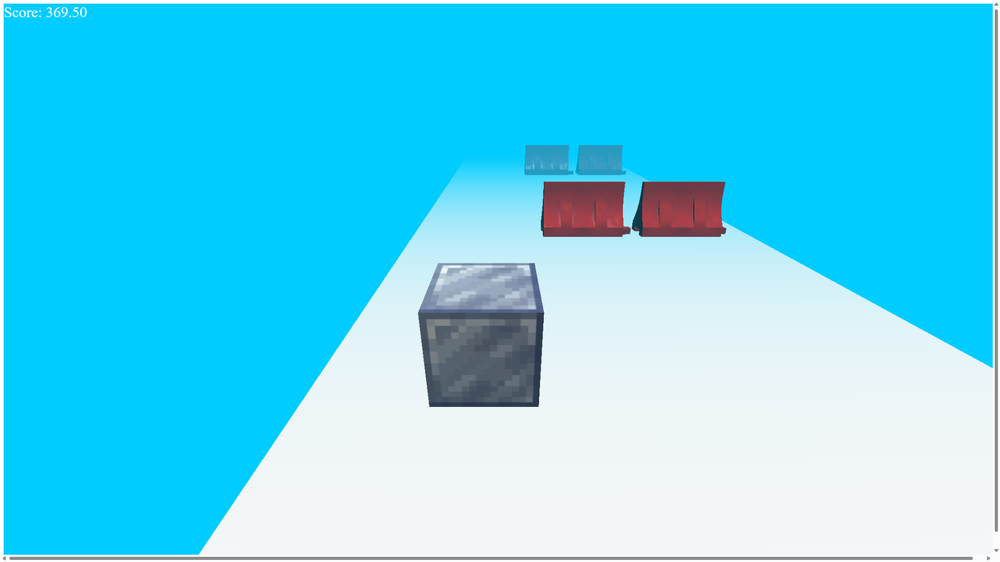

# Hehe Box
*A Computer-Graphics Project*

## Description
This game is a simple 3D game. The player controls a box and tries to avoid the obstacles. The player can move the box by using A and D key. The game is written in *javascript* and uses the *three.js* library.

## Screenshots

